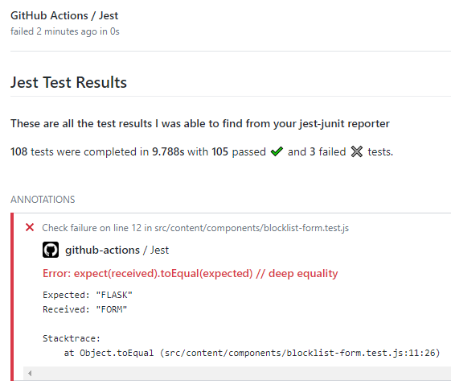

# Jest Github Actions Reporter

Creates annotations based on the output of `jest-junit` (see [how to configure `jest-junit` properly](./README.md#jest-junit-configuration)) in your test files.

## Example

<kbd>.github/workflows/your-workflow.yml</kbd>
```
    - uses: IgnusG/jest-report-action@v{ current version }
      if: always() # Or use "continue-on-error: true" in previous test step
      with:
        access-token: ${{ secrets.GITHUB_TOKEN }}
``` 



## Inputs

### `access-token` - **required**

We'll need that to enrich the actions run with annotations. The secret is automatically generated by github.com.

### `junit-file` - *optional*

The location and/or the name of the JUnit file. `jest-junit` uses <kbd>junit.xml</kbd> as a default, which is the default here too. If you haven't changed it, you can omit this input.

### `run-name` - *optional*

The name of your run. This is typically `build` but can be configured individually. Make sure it matches your workflow config:

<kbd>.github/workflows/your-workflow.yml</kbd>
```yaml
build: # <- this one!
    steps:
        ...
```

### `check-name` - *optional*

A custom name that will appear in the PR's check window. Useful if you have multiple test suites - code, pipelines, publishing process etc., each run with separate jest commands.  
Be sure to run this action after each jest run, that way you can use the same name for the JUnit file - or omit it. 

Otherwise you have to give each generated JUnit file a unique name and pass it to `jest-report-action`.

## `jest-junit` Configuration

Have a look at how to call `jest-junit` in your workflows in the [documentation](https://www.npmjs.com/package/jest-junit#usage).
A very simple example is calling jest with a custom `--reporters` parameter:

<kbd>package.json</kbd> and other
```
  jest --ci --reporters=default --reporters=jest-junit
```

To provide **correct annotation locations**, you need to configure `jest-junit` to format the xml file in a compatible way.

Set these in either your package.json or through enviornment variables while running jest in your CI (Github).

<kbd>package.json</kbd>
```json
"jest-junit": {
  "suiteNameTemplate": "{filepath}",
  "classNameTemplate": "{classname}",
  "titleTemplate": "{title}"
}
```

Refer to [`jest-junit` Documentation](https://www.npmjs.com/package/jest-junit#configuration) to see other ways to configure these.

Thank you and have an **amazing day**!
